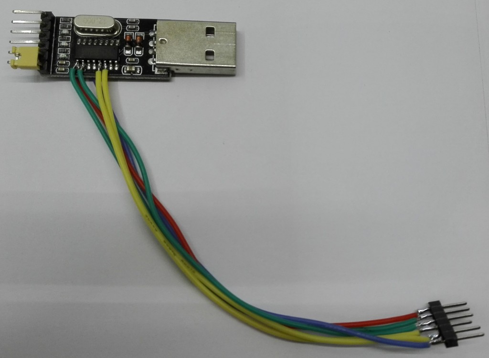
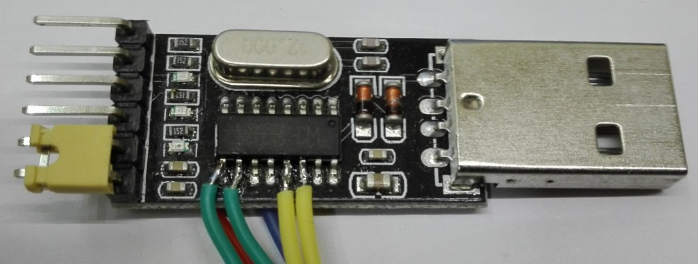
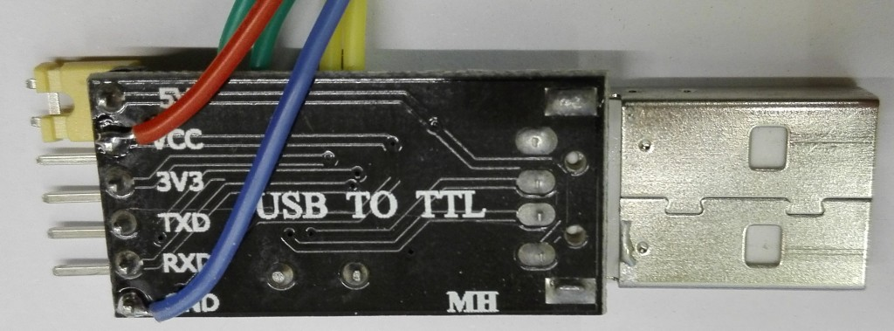

# CH340G-GPIO-mod
Using a cheap USB to serial adapter as a (small) GPIO module

## What is this?
This is basically just a quick note, nothing exciting but it might be handy. It shows how to use a generic CH340G-based USB to serial adapter as a (small and relatively slow) GPIO adapter.

## The problem
I needed a way to reboot a DUT (device under test) from the command line, so i wired a relay in series with the power supply (low voltage side - stay safe!).  
Problem: How can i connect the relay to the PC? 20 years ago the answer would have been the serial/parallel port, but those are more or less gone on todays computers and replaced by USB. USB does not offer GPIOs on the connector...  
  
Of course there are (i assume) dedicated USB to GPIO integrated circuits and you can always use a microcontroller connected directly to USB or via a USB to serial adapter, but using a microcontroller to toogle a single relay? Somewhat wasteful (chip shortage is still a thing).  
  
But wait a second - those USB to serial adapter i (and you) have lying around do have (for some/most of them) some RS232 status pins in addition to the often only used RX and TX pins. The CH340G are/were especially cheap at some point and the IC has a pitch of 1,27mm (and not like 0,5mm) so it is easy to add some wires.

## The hardware
Well, basically you just need to solder some wires to the right pins of the CH340G, pins that are NC on the classic, simple USB to serial adapters. Looking at the documentation there are 4 inputs and 2 outputs on the CH340G in addition to the TX/RX (that should remain functional after this mod). Not too bad, isn't it? In my case i soldered 6 wires to the module: 2 inputs (grey), 2 outputs (yellow), Vcc (red) and - important - GND (blue). After this i just had to add a resistor, a transistor and a diode to switch my relay.  
  
Bonus: The CH340G modules i have have a jumper to select between 3,3V and 5V, this voltage is used for all the IOs. I soldered the red wire on the Vcc pin that can be connected to 3,3V or 5V; this means that i have the *actual* voltage (3,3V or 5V as i said) used by the module/IC on this wire. For switching stuff 5V is fine, but if you want to interface something else 3,3V might be better or even mandatory.  
  
In theory, with some software, you can even use this hack to "talk" other protocols like SPI or I2C (with additional bits of hardware), however don't expect much speed. There are dedicated USB to $anything modules that might be better suited (but are probably more expensive or more difficult to get or ...).

### Pictures

  
  
  

### Pinout (CH340G)
|Pin|Name|Direction|
|----|----|--------|
|9|CTS#|Input|
|10|DSR#|Input|
|11|RI#|Input|
|12|DCD#|Input|
|13|DTR#|Output|
|14|RTS#|Output|

## The software
For switching/reading the IOs you will need some software. I used some piece of Perl5-code (tested on Linux only). Beware of the inverted logic, writing a '0' to the pin will get you Vcc!  
For my relay i used this piece of code:
```
#! /bin/env perl

#piece of code for toogling a pin on the CH340G, used to power-cycle a DUT using a relay
#2022 by kittennbfive
#CC0 and NO WARRANTY!

use strict;
use warnings FATAL=>'all';
use Device::SerialPort; #you need to install this as usual

#beware of inverted logic, use these constants!
use constant PIN_ON=>0;
use constant PIN_OFF=>1;

my $device='ttyUSB0';

my $port=new Device::SerialPort("/dev/$device", undef, undef) || die "can't open device $device\n";

$port->dtr_active(PIN_OFF);
sleep(2);
$port->dtr_active(PIN_ON);
```
Perl5 is somewhat dead :-( , but the same thing should be doable in almost any language, from C (`ioctl()` i assume?) to Python (don't ask, no idea).  
If you are curious, with a loop without any delay in the code the pin toogled at about 6kHz, but with a lot of jitter.

## Licence
CC0 for the piece of code, CC BY-SA 4.0 for text and pictures. NO WARRANTY!
